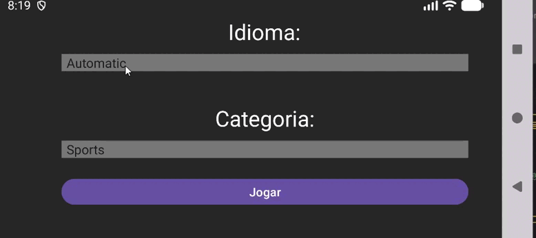
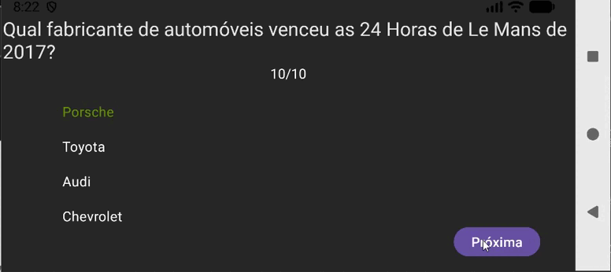

# 🧠 AppQuiz - Trivia Challenge

 

[](#)
[](#)
[](#)

O **AppQuiz** é um aplicativo Android desenvolvido em Java que desafia o conhecimento do usuário com perguntas dinâmicas. O projeto evoluiu de um exercício de curso para uma aplicação **Full Stack**, conectada a uma API própria em Node.js.

---

## 🆙 Atualizações Recentes (V2.0)

Nesta nova versão, o projeto deixou de consumir diretamente a API externa para utilizar um **Backend Próprio**, trazendo as seguintes melhorias:

- **Seleção Dinâmica de Idiomas**: Integração com a rota `/quiz/idiomas` para popular Spinners via API.
- **Filtro por Categorias**: Agora o usuário escolhe o tema do quiz através da rota `/quiz/categorias`.
- **Tradução em Tempo Real**: O Backend em Node.js processa a tradução das perguntas antes de enviá-las ao App.
- **Arquitetura Descentralizada**: O App agora é um cliente que consome um serviço customizado, permitindo maior controle sobre os dados.

## 🚀 Diferenciais deste Projeto

- **Consumo de API Customizada**: Integração com servidor local Node.js via IP de loopback (`10.0.2.2`).
- **Navegação entre Activities**: Uso de `Intents` com `Extras` para passar parâmetros de configuração para a tela de jogo.
- **Parse Dinâmico de JSON**: Tratamento de `JSONArray` e `JSONObject` para renderização de perguntas e alternativas.
- **UX Fluida**: Gerenciamento de Threads para evitar travamentos na UI durante requisições de rede.

## 🛠️ Tecnologias Utilizadas

### Mobile (Android)
- **Linguagem**: Java.
- **Comunicação**: `HttpURLConnection` (Requisições REST nativas).
- **Componentes**: `Spinners`, `RadioGroup`, `ProgressBar` e `AlertDialog`.

### Backend (API)
- **Runtime**: Node.js.
- **Framework**: Express com Consign.
- **Integrações**: Google Translate API e Open Trivia DB.


## 🧩 Implementação Técnica (Android)

Para buscar as perguntas com base na escolha do usuário, implementei a passagem de parâmetros via Intent:

```java
// Exemplo de passagem de dados entre telas
Intent it = new Intent(this, MainActivity.class);
it.putExtra("p_idioma", idiomaSelecionado.codigo);
it.putExtra("p_categoria", categoriaSelecionada.id);
startActivity(it);
```

## E no recebimento, a URL é montada dinamicamente:
```java
String urlFinal = "[http://10.0.2.2:3000/quiz/](http://10.0.2.2:3000/quiz/)" + idioma;
if (categoriaId > 0) urlFinal += "/" + categoriaId;
```

## 📈 Evolução Pessoal
Este projeto marca minha transição para o desenvolvimento Full Stack Mobile. A principal lição foi entender a importância da ordem de precedência em rotas de API e como sincronizar tipos de dados (Array vs Object) entre diferentes ecossistemas (JavaScript e Java).

Desenvolvido com foco em boas práticas de engenharia por [Rafael Santos](https://rafaeldev2001.com/).